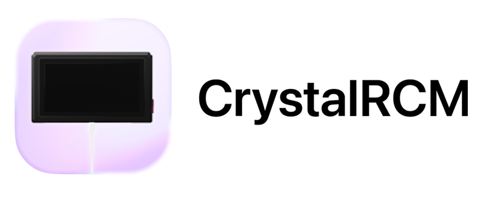

Welcome to CrystalRCM, rewritten in Rust for faster speeds and more stability if the original one doesn't work!

If this doesn't work either, use JTegraNX in command line mode.

[**Come check the original project here!**](https://github.com/prayerie/CrystalRCM)

## Support
There aren't really any "required" macOS versions. Just have a stable and relatively new version of macOS and you should be good to go.
I would say **macOS Ventura 13** would be the minimum.
If you get it to work on earlier versions, great for you. I don't provide support.

I also highly recommend having libusb installed via brew. If you don't know how to that, just open your Terminal (Spotlight > Terminal)  
And paste this command: `/bin/bash -c "$(curl -fsSL https://raw.githubusercontent.com/Homebrew/install/HEAD/install.sh)"; brew install gcc libusb`

## Building

### Before proceeding
You NEED the cargo chain and basically all tools to make rust apps.

### Proceedure
To build, there is only one command to run:

``chmod +x build.sh && ./build.sh``

It may take a while since it has to build all the libraries, ect...

The building file will compile for **your** computer architecture. If you wanna compile "universally" (ARM and Intel), please  
fork the repo and use GitHub Actions.